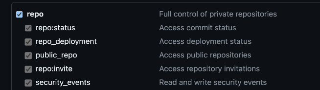

# HelmUp - Charts Auto-Updater
[](https://artifacthub.io/packages/helm/helmup/helmup)   

**HelmUp** is a Kubernetes-based utility designed to upgrade the configuration of both community-maintained and self-owned Helm charts.  


# What is Helmup?

Helmup is an innovative tool designed for Ops Engineers, making Helm chart upgrades effortless and efficient.

As an Ops Engineer, you often need to upgrade Helm chart versions for various reasons:

- Security Fixes
- New Features
- Staying Up-to-Date
- And More...

To streamline this process, we created HELMUP!

Leveraging AI, Helmup scans your GitHub repositories, identifies all your Helm charts, and searches online for the latest updates. Once a new version is found, the AI engine automatically updates your files and values, and then:

- Creates a Pull Request (PR) in your GitHub repository
- Optionally generates a Jira ticket
- Optionally sends notifications via Slack or Microsoft Teams

### Architecture

Helmup is built on a microservices architecture, consisting of three core components:

- Engine: Handles the AI and upgrade mechanism
- Scraper: Scans your GitHub repository for Helm charts
- Notifications: Manages notifications through MS Teams or Slack


## 💫 The Magic We Offer
| Chart Type  | Upgrade Description |
| ------------- | ------------- |
| `Self-owned` Charts  | Upgrade to a predefined, desired Kubernetes version.  |
| `Community-maintained` Charts  | Upgrade to the next available version.  |  
</br>

## Requirements 

```
⚠️ Note: The helmup Application is designed to work on Values.yaml files resides in a Git Repo (Gitops style.)
We currently not supprting any other installation methods for helm (For example, using --set). Upcomming feature in the CLI.
```

### Tokens

* OpenAI/ChatGPT token - for use in the engine. [How to create this token?](#creating-an-openai-chatgpt-token)

Note: All models versions are supported. Best performence with `ChatGPT 4.0`
* GitHub Token - To scrape customer Repo. [How to create this token?](#creating-a-classic-gitHub-token)  

<i>Optionally:</i>
* [Slack](#How-to-create-a-slack-webhook) / Teams Webhook Token
* Jira token

### Kubernetes Secrets
The application expects a k8s secret "helmup-secret" with the following keys:

```["openai_token", "github_token", "jira_token", "webhook_url"(Optional) ]```

We provided a convinient way to use `ExternSecrets` application to retreive them. If used externally, make sure to create a secret named `helmup-secret` with these keys!

### See [Mandatory Secrets](#mandatory-secrets) section for more info! 

## ▶️ Getting started
### Instructions

1. **Access the Helm Chart:**  
    Go directly to the [Helmup Helm chart on ArtifactHub](https://artifacthub.io/packages/helm/helmup/helmup).

2. **Download the Latest Version:**
    ```bash
    helm repo add sirrend https://sirrend.github.io/helmup/releases/
    helm repo update
    helm pull sirrend/helmup
    ```

3. **Install or Upgrade:**  
    You can now proceed to install or upgrade the Helm chart using the downloaded version.

    ```bash
    helm upgrade --install <release-name> sirrend/helmup --version 0.1.0
    ```
</br>

## Mandatory Secrets

| Secret Key                | Required  | Secret Name       | Description                                                   |
| --------------------------| --------- | ----------------- | --------------------------------------------------------------|
| `openai_token`            | true      | `helmup-secret`   | Your personal OPENAI token to be used in the engine.          |
| `github_token`            | true      | `helmup-secret`   | Your persoanl github token to be used to scrape the git repo. |
| `jira_token`              | false     | `helmup-secret`   | Your Jira token to be used to open Jira tickets (Optional).   |
| `webhook_url`             | false     | `helmup-secret`   | Your webhook URL for Slack / MS Teams only (Optional).        |

</br>

## ⚙️ Helm Chart Global Values
<details>
Global Values for the application. Read carefully before installation!
<summary>Global</summary>

| Key | Type | Default | Description |
|-----|------|---------|-------------|
| global.appConfig.github.CUSTOMER_NAME | string | `"sirrend"` | Required: Github account / project name |
| global.appConfig.github.GIT_BRANCH | string | `"main"` | Required: Github branch name to scrape |
| global.appConfig.github.GIT_REPOSITORY_NAME | string | `"kuba_test"` | Required: Github repo name |
| global.appConfig.github.GIT_REPOSITORY_URL | string | `"https://github.com/sirrend/kuba_test.git"` | Required: Github repository URL |
| global.appConfig.jira.enabled | bool | `true` | Required: Whether to enable jira notifications / tickets creation |
| global.appConfig.jira.project_key | string | `"SI"` | The jira project key |
| global.appConfig.jira.server_url | string | `"https://sirrend.atlassian.net/"` | The jira server URL |
| global.appConfig.jira.username | string | `"yuvalpress@gmail.com"` | Jira username |
| global.appConfig.notifications.enabled | bool | `true` | Required: Whether or not to send notification via channels (slack or teams - as configured in the notifications section) |
| global.appConfig.notifications.type | string | `"slack"` | Valid options are ["slack", "teams", "None"] |
| global.appConfig.reformat_helm_templates | bool | `true` | Whether or not to improve the helm manifest using AI capabilities. Recommended! |
| global.appConfig.target_kube_version | string | `"1.30.0"` |  |
| global.appConfig.upgrade_majors | string | `"disabled"` | Whether or not to upgrade major chart's versions |
| global.externalSecret.backendType | string | `"secretsManager"` | Specify the secretStoreRef, e.g., secretsManager for AWS Secrets Manager |
| global.externalSecret.enabled | bool | `true` | Required: Support for external secrets operator: Enables/Disables externalSecret to be imported to the namespace. Conflicts with "secretNameOverride" |
| global.externalSecret.refreshInterval | string | `"30h"` | Speficy the refresh interval for the secret |
| global.externalSecret.secretKeyGithub | string | `"sirrend-github-token"` | The secret name to pull from SecretStore for the Github token |
| global.externalSecret.secretKeyJira | string | `"sirrend-jira-token"` | The secret name to pull from SecretStore for the Jira token |
| global.externalSecret.secretKeyNotificationsWebhookUrl | string | `"sirrend-slack-webhook-secret"` | The secret name to pull from SecretStore for the notifications channel (slack/teams) webhhok url |
| global.externalSecret.secretKeyOpenAI | string | `"chatgpt-token"` | The secret name to pull from SecretStore for the openAI chatgpt token |
| global.externalSecret.secretStoreRef | object | `{"kind":"ClusterSecretStore","name":"aws-secrets-manager"}` | Specify the secretStoreRef |
| global.externalSecret.secretTemplate | object | `{"annotations":{},"data":{},"labels":{},"type":"Opaque"}` | externalSecret template |
| global.externalSecret.secretVersion | string | `""` | Optional |
| global.secretNameOverride | string | `""` | If using a self-defined secret, specify its name |
</details>
</br>

## ⚙️ Helm Chart Services Values
<details>
Values for the different Microservices: `engine`, `notifications` and `scraper`
<summary>Applications</summary>

| Key | Type | Default | Description |
|-----|------|---------|-------------|
| engine.affinity | object | `{}` |  |
| engine.autoscaling.enabled | bool | `false` |  |
| engine.autoscaling.maxReplicas | int | `10` | Max number of pods to run |
| engine.autoscaling.minReplicas | int | `1` | Min number of pods to run |
| engine.autoscaling.targetCPUUtilizationPercentage | int | `80` | The threshold of CPU utilization to scale up upom  |
| engine.fullnameOverride | string | `""` |  |
| engine.image.pullPolicy | string | `"Always"` | imagePullPolicy - Highly recommended to leave this as Always |
| engine.image.repository | string | `"sirrend/helmup-engine"` | Repository for the helmup-engine image |
| engine.image.tag | string | `"0.1.13"` | The helmup-engine image tag to use |
| engine.imagePullSecrets | list | `[]` | A list of image pull secret names to use |
| engine.ingress.annotations | object | `{}` |  |
| engine.ingress.className | string | `""` | From Kubernetes 1.18+ this field is supported in case your ingress controller supports it. When set, you do not need to add the ingress class as annotation. |
| engine.ingress.enabled | bool | `false` | Enables an ingress object for the application |
| engine.ingress.hosts[0].host | string | `"chart-example.local"` |  |
| engine.ingress.hosts[0].paths[0].path | string | `"/"` |  |
| engine.ingress.hosts[0].paths[0].pathType | string | `"ImplementationSpecific"` |  |
| engine.ingress.tls | list | `[]` |  |
| engine.livenessProbe.enabled | bool | `true` |  |
| engine.livenessProbe.failureThreshold | int | `3` |  |
| engine.livenessProbe.initialDelaySeconds | int | `15` |  |
| engine.livenessProbe.path | string | `"/healthcheck"` | Please do not change this |
| engine.livenessProbe.periodSeconds | int | `300` |  |
| engine.livenessProbe.port | int | `8090` |  |
| engine.livenessProbe.timeoutSeconds | int | `5` |  |
| engine.nameOverride | string | `"engine"` |  |
| engine.nodeSelector | object | `{}` |  |
| engine.podAnnotations | object | `{}` | Extra annotations for the engine pod |
| engine.podLabels | object | `{}` |  |
| engine.podSecurityContext | object | `{}` | Defines the podSecurityContext for the engine pod |
| engine.readinessProbe.enabled | bool | `false` |  |
| engine.readinessProbe.failureThreshold | int | `3` |  |
| engine.readinessProbe.initialDelaySeconds | int | `20` |  |
| engine.readinessProbe.path | string | `"/healthcheck"` | Please do not change this |
| engine.readinessProbe.periodSeconds | int | `10` |  |
| engine.readinessProbe.port | int | `8090` |  |
| engine.readinessProbe.timeoutSeconds | int | `5` |  |
| engine.replicaCount | int | `1` | Number of engine pods to run |
| engine.resources | object | `{}` | A resources block for the engine pod |
| engine.securityContext | object | `{}` | The container securityContext for the controller container |
| engine.service.port | int | `80` | The port to run the dashboard engine on |
| engine.service.type | string | `"ClusterIP"` | The type of the engine service |
| engine.serviceAccount.annotations | object | `{}` | Extra annotations for the service account that will be created |
| engine.serviceAccount.automount | bool | `true` | If true, the service account will be mounted automatically |
| engine.serviceAccount.create | bool | `true` | If true, a service account will be created for the controller. If set to false, uses default serviceAccount |
| engine.serviceAccount.name | string | `""` | The name of an existing service account to use for the controller |
| engine.startupProbe.enabled | bool | `true` |  |
| engine.startupProbe.failureThreshold | int | `3` |  |
| engine.startupProbe.initialDelaySeconds | int | `10` |  |
| engine.startupProbe.path | string | `"/healthcheck"` | Please do not change this |
| engine.startupProbe.periodSeconds | int | `10` |  |
| engine.startupProbe.port | int | `8090` |  |
| engine.startupProbe.timeoutSeconds | int | `5` |  |
| engine.tolerations | list | `[]` |  |
| engine.volumeMounts | list | `[]` | Extra volumes for the engine pod |
| engine.volumes | list | `[]` | Extra volume mounts for the engine container |
| notifications.affinity | object | `{}` |  |
| notifications.enabled | bool | `true` |  |
| notifications.fullnameOverride | string | `""` |  |
| notifications.image.pullPolicy | string | `"Always"` | imagePullPolicy - Highly recommended to leave this as Always |
| notifications.image.repository | string | `"sirrend/helmup-notifications-service"` | Repository for the helmup-notifications-service image |
| notifications.image.tag | string | `"0.1.3"` | The helmup-github-scraper image tag to use |
| notifications.imagePullSecrets | list | `[]` | A list of image pull secret names to use |
| notifications.livenessProbe.enabled | bool | `true` |  |
| notifications.livenessProbe.failureThreshold | int | `3` |  |
| notifications.livenessProbe.initialDelaySeconds | int | `15` |  |
| notifications.livenessProbe.path | string | `"/health"` | Please do not change this |
| notifications.livenessProbe.periodSeconds | int | `300` |  |
| notifications.livenessProbe.port | int | `9000` |  |
| notifications.livenessProbe.timeoutSeconds | int | `5` |  |
| notifications.nameOverride | string | `"notifications-service"` |  |
| notifications.nodeSelector | object | `{}` |  |
| notifications.podAnnotations | object | `{}` | Extra annotations for the notifications pod |
| notifications.podLabels | object | `{}` |  |
| notifications.podSecurityContext | object | `{}` | Defines the podSecurityContext for the notifications pod |
| notifications.readinessProbe.enabled | bool | `false` |  |
| notifications.readinessProbe.failureThreshold | int | `3` |  |
| notifications.readinessProbe.initialDelaySeconds | int | `20` |  |
| notifications.readinessProbe.path | string | `"/health"` | Please do not change this |
| notifications.readinessProbe.periodSeconds | int | `30` |  |
| notifications.readinessProbe.port | int | `9000` |  |
| notifications.readinessProbe.timeoutSeconds | int | `5` |  |
| notifications.replicaCount | int | `1` | Number of engine pods to run |
| notifications.resources | object | `{}` | A resources block for the notifications pod |
| notifications.securityContext | object | `{}` | The container securityContext for the controller container |
| notifications.service.port | int | `80` | The port to run the dashboard engine on |
| notifications.service.type | string | `"ClusterIP"` | The type of the engine service |
| notifications.serviceAccount.annotations | object | `{}` | Extra annotations for the service account that will be created |
| notifications.serviceAccount.automount | bool | `true` | If true, the service account will be mounted automatically |
| notifications.serviceAccount.create | bool | `true` | If true, a service account will be created for the controller. If set to false, uses default serviceAccount |
| notifications.serviceAccount.name | string | `""` | The name of an existing service account to use for the controller |
| notifications.startupProbe.enabled | bool | `false` |  |
| notifications.startupProbe.failureThreshold | int | `3` |  |
| notifications.startupProbe.initialDelaySeconds | int | `30` |  |
| notifications.startupProbe.path | string | `"/health"` | Please do not change this |
| notifications.startupProbe.periodSeconds | int | `10` |  |
| notifications.startupProbe.port | int | `9000` |  |
| notifications.startupProbe.timeoutSeconds | int | `5` |  |
| notifications.tolerations | list | `[]` |  |
| notifications.volumeMounts | list | `[]` | Extra volumes for the notifications pod |
| notifications.volumes | list | `[]` | Extra volume mounts for the notifications container |
| scraper.affinity | object | `{}` |  |
| scraper.cronJobExpression | string | `"0 0 * * *"` | Required: the cronJob expressions to scrape the git repo |
| scraper.failedJobsHistoryLimit | int | `1` | Required: failed job history limit |
| scraper.fullnameOverride | string | `""` |  |
| scraper.image.pullPolicy | string | `"Always"` | imagePullPolicy - Highly recommended to leave this as Always |
| scraper.image.repository | string | `"sirrend/helmup-github-scraper"` | Repository for the helmup-github-scraper image |
| scraper.image.tag | string | `"0.1.4"` | The helmup-github-scraper image tag to use |
| scraper.imagePullSecrets | list | `[]` | A list of image pull secret names to use |
| scraper.nameOverride | string | `"github-scraper"` |  |
| scraper.nodeSelector | object | `{}` |  |
| scraper.podAnnotations | object | `{}` | Extra annotations for the scraper pod |
| scraper.podLabels | object | `{}` |  |
| scraper.podSecurityContext | object | `{}` | Defines the podSecurityContext for the scraper pod |
| scraper.replicaCount | int | `1` | Number of engine pods to run |
| scraper.resources | object | `{}` | A resources block for the scraper pod |
| scraper.securityContext | object | `{}` | The container securityContext for the scraper container |
| scraper.serviceAccount.annotations | object | `{}` | Extra annotations for the service account that will be created |
| scraper.serviceAccount.automount | bool | `true` | If true, the service account will be mounted automatically |
| scraper.serviceAccount.create | bool | `true` | If true, a service account will be created for the controller. If set to false, uses default serviceAccount |
| scraper.serviceAccount.name | string | `""` | The name of an existing service account to use for the controller |
| scraper.successfulJobsHistoryLimit | int | `3` | Required: successful job history limit |
| scraper.tolerations | list | `[]` |  |
| scraper.volumeMounts | list | `[]` | Extra volumes for the scraper pod |
| scraper.volumes | list | `[]` | Extra volume mounts for the scraper container |
</details>
</br>

# Helper Guides

## Creating a Classic GitHub token
<details>

### 1. Sign In to Your GitHub Account

- Visit [GitHub](https://github.com/) and sign in with your credentials.

### 2. Navigate to Developer Settings

- In the upper-right corner of any page, click on your profile photo, then select **Settings** from the dropdown menu.
- Scroll down to the bottom of the left sidebar and click on **Developer settings**.

### 3. Go to Personal Access Tokens

- In the left sidebar, click on **Personal access tokens**.
- Then click on **Tokens (classic)**.

### 4. Generate a New Token

- Click the **Generate new token** button.
- Add a descriptive **note** to identify what this token will be used for.

### 5. Set the Expiration Date (Optional)

- Select an expiration date for your token if you want it to automatically expire after a certain period. GitHub recommends setting a token expiration to keep your account secure.

### 6. Select "Repo" Permissions

- In the **Select scopes** section, check the box for **repo**. This will give the token full control of private repositories, including the ability to read and write to repositories, as well as access to issues and pull requests.



### 7. Generate the Token

- After selecting the necessary permissions, scroll down and click the **Generate token** button.

- **Copy your new personal access token**. You won’t be able to see it again once you leave this page.

### 8. Store Your Token Securely

- Store your token securely. Treat it like a password—never share it publicly or expose it in your code. If your token is ever compromised, revoke it immediately and generate a new one.

### Important Notes

- **Security**: Always keep your token secure. Do not hard-code it directly into your source files. Use environment variables or secret management tools.
- **Revoking a Token**: If you no longer need the token or if it is compromised, return to the **Tokens (classic)** section under **Developer settings** and click **Delete** next to the token to revoke it.
- **Permissions**: Be cautious with the permissions you assign to a token. Only grant the minimum permissions necessary for your use case.
</details>
</br>

## Creating an OpenAI ChatGPT token

<details>
### How to Create a ChatGPT API Token

To create a token for OpenAI's GPT models, including ChatGPT, you'll need to follow these steps to generate an API key through OpenAI:

### 1. Sign Up for an OpenAI Account
If you don't already have an OpenAI account, you'll need to create one. Visit [OpenAI's website](https://platform.openai.com/signup) and sign up for an account.

### 2. Access the API Dashboard
Once you've logged in to your OpenAI account, navigate to the [API dashboard](https://platform.openai.com/account/api-keys).

### 3. Generate a New API Key
In the API dashboard, you will see an option to create a new API key. Click the "Create new secret key" button.

A new API key will be generated. **Make sure to copy and save this key in a secure place**, as it will not be shown again.

### 4. Use Your API Key
You can use this API key to authenticate requests to OpenAI's API endpoints. In your application or script, use this key to make requests to the OpenAI API, allowing you to access GPT-3.5, GPT-4, or other models.

### Important Notes

- **Security**: Treat your API key like a password. Keep it private and never share it publicly. If your key is compromised, you can regenerate it from the API dashboard.
- **Rate Limits and Usage**: Be aware of OpenAI's rate limits and usage policies, which depend on your plan. You can monitor your usage on the same dashboard where you created the key.
- **Billing**: Ensure you understand the billing structure. Depending on your usage and the model you use, costs may vary. OpenAI provides details on pricing on their [pricing page](https://openai.com/pricing).
</details>
</br>

## How to Create a Slack Webhook
<details>
A Slack webhook allows you to send messages from external applications to your Slack workspace. Follow these steps to create a Slack webhook:

### 1. Sign In to Your Slack Workspace

- Go to [Slack](https://slack.com/) and sign in with your workspace credentials.

### 2. Navigate to Slack API

- Visit the [Slack API: Incoming Webhooks](https://api.slack.com/messaging/webhooks) page.

### 3. Create a New App

- Click the **Create an App** button.

### 4. Configure Your Slack App

- In the pop-up window, select **From scratch**.
- Enter a **name** for your app (e.g., "My Webhook App").
- Select the Slack **workspace** where you want to install the app, then click **Create App**.

### 5. Set Up Incoming Webhooks

- Once your app is created, you will be redirected to the app settings page.
- In the left sidebar, click on **Incoming Webhooks**.
- Toggle the **Activate Incoming Webhooks** switch to **On**.

### 6. Create a New Webhook URL

- Scroll down to the **Webhook URLs for Your Workspace** section.
- Click the **Add New Webhook to Workspace** button.

### 7. Select a Channel

- You will be redirected to a page where you can select a channel to post messages to. Choose the appropriate channel from the dropdown list.
- Click the **Allow** button to grant your app permission to post in the selected channel.

### 8. Copy Your Webhook URL

- After allowing permissions, you will be redirected back to the Incoming Webhooks settings page.
- You will see a new webhook URL under the **Webhook URLs for Your Workspace** section.
- **Copy the webhook URL**. This is the URL you'll use to send messages to Slack from your external applications.

### 9. Test Your Webhook

- To test your webhook, you can use a tool like `curl` or Postman to send a POST request.
- Here's an example using `curl` in the terminal:
  ```bash
  curl -X POST -H 'Content-type: application/json' --data '{"text":"Hello, Slack!"}' YOUR_WEBHOOK_URL

</details>
</br>

# 🚀 What's Next?
1. Upgrade capability for targeting specific community-chart versions.
2. Enhanced UI for managing and visualizing the current state of charts.
3. Extended support for additional notification channels and methods.  

<strong>Stay tuned for more updates and improvements!</strong>

</br>

# ©️ LICENSE - BSL Restricted
### 👥 Maintainers
| Name    | Email                | Website                  |
|---------|----------------------|--------------------------|
| Sirrend | business@sirrend.com | https://www.sirrend.io/  |
